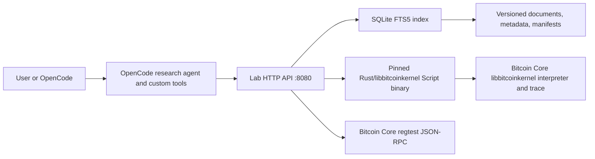

# Bitcoin Research Lab

A small, runnable local foundation for citation-grounded Bitcoin research. It combines a versioned source library, SQLite full-text/metadata search, a pinned Rust/libbitcoinkernel Bitcoin Script tool, OpenCode-compatible research tools, and a Bitcoin Core regtest node.

No proprietary credentials are required. The existing `api.key` is intentionally ignored by Git, excluded from the Docker build context, and neither mounted nor read by the lab.

## Start the lab

Requirements: Docker with Compose v2. The Compose stack uses the `bitcoin/bitcoin:31.1` testing image for a local regtest node; this community image is not an official Bitcoin Core release channel and should not be used as a production trust root.

```sh
docker compose up -d --build
python3 scripts/smoke_test.py
```

The API is then at <http://127.0.0.1:8080>. Stop it with:

```sh
docker compose down
```

`docker compose down -v` also deletes the disposable regtest chain and search-index volumes.

## What runs



The lab image contains all Python application components and the sample library. Compose mounts the host library read-only so new versioned documents can be reindexed without rebuilding. Bitcoin Core is isolated on the Compose network and exposes no host port.

## API and CLI

Health and Core status:

```sh
curl http://127.0.0.1:8080/health
curl http://127.0.0.1:8080/api/v1/bitcoin/status
```

Full-text plus metadata search:

```sh
curl 'http://127.0.0.1:8080/api/v1/search?q=package%20relay&collection=delving-bitcoin&tag=cpfp'
python3 -m lab.cli search 'transaction pinning' --collection mailing-lists
```

Script vector:

```sh
curl -X POST http://127.0.0.1:8080/api/v1/script/evaluate \
  -H 'content-type: application/json' \
  -d '{"unlocking_script":"2 3 OP_ADD","locking_script":"5 OP_EQUAL"}'
```

The endpoint must report backend `rust-bitcoinkernel` at revision `691a90cc0c20761cc9b35a783e0e84c77245d555`; the HTTP layer has no Python fallback. It evaluates the scripts through Bitcoin Core's libbitcoinkernel in a deterministic synthetic legacy transaction. See [docs/INTERPRETER.md](docs/INTERPRETER.md) for build, licensing, flags, trace, and transaction-context scope.

## Library layout and ingestion

```text
library/
├── source-registry.json     fetch strategy, limits, hosts, rights, and Git pins
├── ingestion/               rights policy and the latest machine-readable report
├── schemas/                 JSON Schemas for manifests and document metadata
├── manifests/               upstream collections and imported item ledgers
├── raw/                     exact fetched bytes keyed by stable document ID
└── documents/
    ├── papers/
    ├── delving-bitcoin/
    ├── mailing-lists/
    └── source-specific public snapshots
```

Each Markdown file has an adjacent `*.metadata.json`. To add a document, copy an existing metadata record, assign a stable unique ID, record provenance and reuse rights, add the item to its source manifest, then run:

```sh
make validate
make index
make test
```

The original Delving Bitcoin and mailing-list fixtures remain explicitly synthetic. The library also contains a bounded public snapshot from Bitcoin development mailing lists, Delving Bitcoin, robinlinus.com, Fairgate, Alpen Labs, Babylon Labs, Citrea documentation, two pinned Git repositories, and Robin Linus's public gists.

Re-run the incremental, credential-free importer with:

```sh
python3 scripts/ingest_sources.py
# or lower every registry cap for a small refresh
python3 scripts/ingest_sources.py --max-items 6
```

The importer checks `robots.txt` before public HTTP requests, uses a one-second per-host delay and 20-second request timeout, rejects non-allowlisted hosts, and records skips instead of bypassing restrictions. GitHub repositories use public Git transport and immutable commits; gists use the capped unauthenticated public API. It never reads `api.key` or any credential. Public availability is not treated as a redistribution license; see `library/ingestion/RIGHTS.md` and `library/ingestion/latest-report.json`.

The current bounded snapshot imported 51 public documents (54 including the three original fixtures): 6 mailing-list pages, 6 Delving topics, 3 robinlinus.com papers/pages, 4 Fairgate resources, 6 Alpen posts, 2 Babylon posts, 6 `coins/bitcoin-scripts` files, 6 BitVM opcode/doc files, 6 public gist files, and 6 Citrea documentation pages. Four Babylon documentation PDFs were conservatively skipped when their host's robots policy could not be retrieved. The code repositories are pinned respectively to `8f442e4bf8a744dd9bf69b2937bdebcaed5cae77` and `b931a6711ab332fd5923e708c869bed02e39984e`; neither snapshot contained a repository `LICENSE`/`COPYING` file, so no reuse license is asserted.

## OpenCode orchestration and model selection

Project configuration lives in `opencode.json`; tools are defined in `.opencode/tools/bitcoin_lab.ts`. OpenCode 1.18.22 is installed in the lab image and the same project files are copied to `/app`. Start the Compose stack and choose any connected model with `/models`. The project intentionally does not pin a provider or include a proprietary key.

```sh
opencode
# In the TUI: /models
```

Run the bundled copy inside the live lab container:

```sh
docker compose exec lab opencode /app
# In the TUI: /connect, then /models
```

Credentials entered through `/connect` are stored in the `opencode-data` Docker volume, never in the image. Alternatively, pass a provider variable from the host at runtime and select an available model explicitly:

```sh
export OPENAI_API_KEY='your-runtime-key'
docker compose exec -e OPENAI_API_KEY lab \
  opencode run --agent bitcoin-researcher -m openai/model-id \
  'Compare package relay and transaction replacement using the local library.'
```

Inside the container, the custom tools call the running lab API at `http://127.0.0.1:8080/api/v1`. The existing project `api.key` is neither copied nor mounted.

For a single run, select an available model explicitly:

```sh
opencode run --agent bitcoin-researcher -m provider/model \
  'Compare the relay-policy risks of package fee bumping and transaction replacement.'
```

The agent decomposes the question, calls `bitcoin_lab_search`, optionally runs `bitcoin_lab_script`, checks `bitcoin_lab_bitcoin_status`, and returns cited local evidence. Model selection remains a user/session concern, so local Ollama-compatible or hosted providers can be used without changing the lab API.

## Example research flow

Question: “How does package relay help fee bumping, and what should a review test?”

1. Search `package relay fee bumping`; the sample Delving fixture is retrieved.
2. Search `pinning replacement` in mailing-list metadata for an adversarial-policy perspective.
3. Inspect the returned document IDs, canonical links, metadata, and checksums.
4. Check Core status to bind experiments to the local `regtest` node.
5. Report that package relay is policy rather than consensus, and identify the synthetic fixtures as test evidence rather than primary-source consensus.

## Development and limitations

```sh
python3 -m unittest discover -s tests -v
python3 -m lab.cli validate
docker compose config --quiet
```

This first release has bounded rather than exhaustive public-source coverage, lexical retrieval rather than embeddings, no bundled language model, and no production authentication. Script evaluation uses a synthetic legacy transaction and `VERIFY_ALL_PRE_TAPROOT`; it does not yet accept witness data or arbitrary transaction context. Add authentication and network policy before exposing the API beyond a developer machine.


## Tools 
- Knowledge Base 
    - Library of Bitcoin Script primitives
    - Library of Bitcoin research (Papers, mailing list, Bitcoin Talk, Delving Bitcoin, https://en.bitcoin.it/wiki/Script, ... )
    - Library of Cryptography research (cryptography expert agent, Dan's cryptography book, cryptology eprint, consensus papers, ...)
        - [https://mcp.so/servers/doomdagadiggiedahdah_iacr-mcp-server](https://github.com/heewon-chung/eprint-mcp-server)
        - [https://deepakness.com/raw/arxiv-mcp/](https://www.alphaxiv.org/docs/mcp)
    - Bitcoin Knowledge base MCP https://bitcoinknowledge.dev
    - Literature research agent 
    - Bitcoin Core Code for exact protocol reference 
- Experiments
    - Script interpreter for testing
    - Rust Bitcoin     
    - Regtest node for testing
